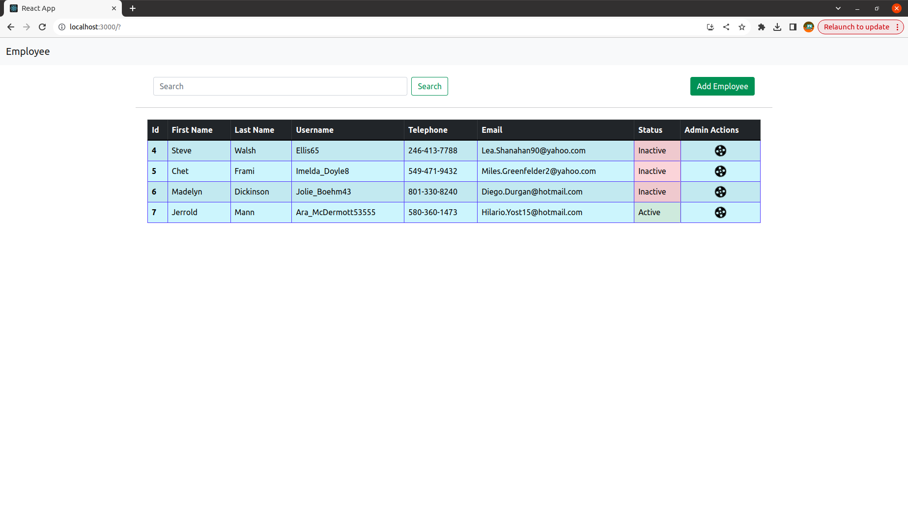

# User Management

# Getting started

## Backend

- Import the project in Intellij
- Run the project

## Fronend

Run the following commands to start the project

- cd Frontend
- npm install
- npm start

## API

- You can import the API in postman
- Please check "postman-api" directory
- I have provided both the revisions (v2 and v2.1) format json.

Thankyou.
Kuamr Utsav Singh
